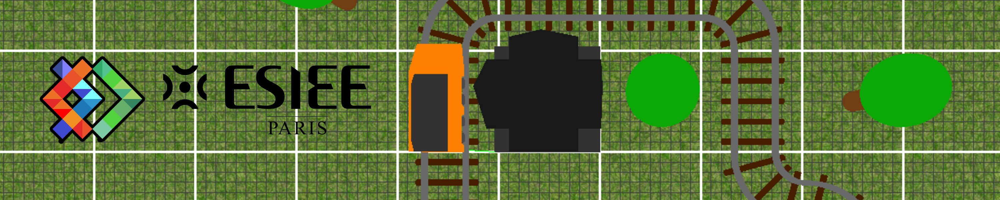
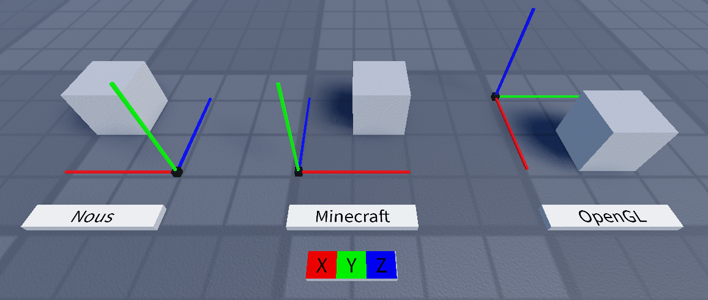

Nils MOREAU--THOMAS - Yanis WONG

# Rapport

## Répartitions des tâches

Yanis a effectué ces tâches :

- Modélisation et placement des rails
- Placement du train
- Éclairage réaliste

Nils a effectué ces tâches :

- Créer la structure du projet
- Correction des bugs et Optimisation du projet
- Refactorisation des coordonnées
- Créer des primitives de bases
- Les caméras
- Ajouter au JSON, modéliser et placer du décors
- Modéliser le train et la gare
- Ajouter des touches pour différentes actions
- Lancer le JSON en argument de ligne de commande
- Lire le JSON
- Placer la gare
- Faire une grille pour visualiser les placements

## Bugs et problèmes résolus

### Identification des bugs

Deux accès à des `std::vector` dans `glbasimac/tools/mesh.hpp` faisait crash le programme car il y avait un accès à des données inexistantes sur les ID de VBO (par le temps que la frame prend à s'exécuter) lors de la "vidange" du Buffer

> Qui causait l'erreur `[...] std::vector<_Tp, _Alloc>::size_type = long unsigned int]: Assertion '__n < this->size()' failed.` et parfois sans s'afficher dans la console.

---

Les chemins pour les shaders étaient en relatif (depuis le dossier `bin`) ce qui contraignait l'exécution depuis EXCLUSIVEMENT bin, si l'on exécutait le .exe sans être placé dans le dossier `bin` cela donnais l'erreur suivante : `ERROR GL : erreur dans le fichier [...]\src\main.cpp à la ligne 276 : INVALID_VALUE (A numeric argument is out of range)`.

Nous avons donc modifié `glbi_engine.cpp` pour avoir une variable de chemin pointant vers `assets/` qui se met à jour depuis le `main.cpp`.

> Avec `assetsPath = (fs::path(argv[0]).parent_path() / "../assets/").string();` qui :
>
> 1. Converti l'argument 0 (chemin du .exe) en objet `fs::path`
> 2. Récupère son dossier parent (`bin/`)
> 3. Va vers `../assets`
>
> Merci la documentation de filesystem.

### Problème d'optimisation du moteur de rendu

Les géométries et les points était initialisés de 0 dans `glbi_convex_2D_shape.cpp` et `glbi_set_of_points.cpp` ce qui faisait éventuellement crash et causait de la latence dans le programme.
Nous avons donc ajouté des `.reInit()` dans ces fichiers pour éviter cela.

## Choix techniques

### Refactorisation des coordonnées

Le système de coordonnées a été refactorisé pour mieux s'aligner avec les conventions
OpenGL.

L'ancien repère **Right-handed Z-up** (X+ derrière, Y+ droite, Z+ haut) a
été remplacé par un repère **Right-handed Y-up** (X+ droite, Y+ haut, Z+ avant),
similaire à celui de Minecraft et plus naturel pour la navigation en scène 3D.

Toutefois, une erreur s'est glissée lors de la refactorisation : une simple rotation
à 180° avec permutation de Y et Z ne suffit pas, il faut également inverser X.
L'axe X s'est donc retrouvé inversé (X+ gauche au lieu de X+ droite), produisant
un repère légèrement non standard.

### Informations ajoutées au JSON

Le JSON possède une information en plus : une liste de positions ou il y a des arbres.

## Difficultés

### Problèmes d'équipe

Le niveau technique étant hétérogène au sein du binôme, la répartition des tâches
a été déséquilibrée, une grande partie du travail ayant été prise en charge par
un seul membre. Ce déséquilibre, couplé à un manque d'anticipation, d'organisation
et d'investissement de la part de l'autre membre, a généré des tensions et ralenti
la progression globale du projet.

### Problèmes du sujet

Le projet de base présentait de nombreux problèmes non documentés, comme les accès invalides aux VBO
ou les chemins de shaders en relatif, rendant l'identification des bugs particulièrement difficile.
De plus, la charge de travail est nettement supérieure aux autres
projets du semestre, d'autant que les TD associés à cette matière ne disposaient
d'aucune correction, ce qui a limité les possibilités d'apprentissage en amont.

## Conclusion

Ce projet a été particulièrement difficile à mener à terme. Le sujet manquait de
clarté sur certains points et différait de ce à quoi nous étions habitués.
Le déséquilibre d'organisation et de compétences au sein du binôme a constitué une
difficulté supplémentaire tout au long du projet.
